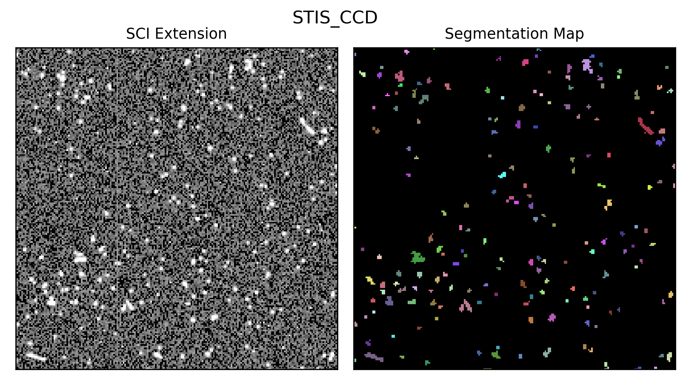
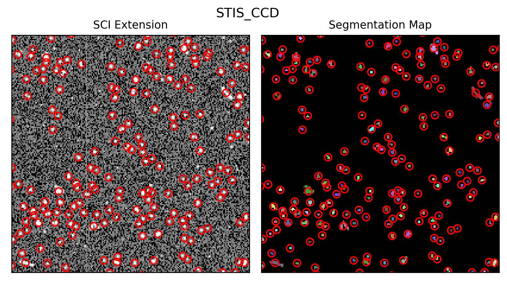

********
Examples
********

In order for the examples listed below to run, you will first need to import
some native `Python` modules and add the location of the repository to your
path.

>>> import glob
>>> import sys
>>> sys.path.append('/Users/nmiles/hst_cosmic_rays/')

Example 1: Running Components of the Pipeline
=============================================
In this example, we demonstrate how to use the underlying functionality to
execute each step of the pipeline individually.

1a: Initialization and Downloading
------------------------------------------
>>> from pipeline.download import download
>>> from pipeline.utils import initialize
>>> initializer = initialize.Initializer(instr='STIS_CCD')
>>> initializer.initialize_dates()
>>> initializer.get_date_ranges()
>>> initializer.get_processed_ranges()
>>> for date_range in initializer.dates[:5]:
...    print(f"{date_range[0].datetime.date()} to {date_range[1].datetime.date()}")
1997-02-01 to 1997-03-01
1997-03-01 to 1997-04-01
1997-04-01 to 1997-05-01
1997-05-01 to 1997-06-01
1997-06-01 to 1997-07-01
>>> d = download.Downloader(instr='STIS_CCD')
>>> date_range = initializer.dates[0]
>>> d.query(date_range=date_range, aws=False)
INFO [download:query:228] Submitting query to MAST
INFO [download:query:253] Filtering observations...
>>> print(d.products.keys())
dict_keys(['1997-02-01'])
>>> d.download('1997-02-01')
INFO [download:download:289] Downloading data...
 Download Directory: /Users/nmiles/hst_cosmic_rays/data/STIS/CCD/
 -------------------------------------------------------------------------------
Downloading URL https://mast.stsci.edu/api/v0.1/Download/file?uri=mast:HST/product/o3st05eaq_spt.fits to /Users/nmiles/hst_cosmic_rays/data/STIS/CCD/mastDownload/HST/o3st05eaq/o3st05eaq_spt.fits ... [Done]
Downloading URL https://mast.stsci.edu/api/v0.1/Download/file?uri=mast:HST/product/o3st05eaq_flt.fits to /Users/nmiles/hst_cosmic_rays/data/STIS/CCD/mastDownload/HST/o3st05eaq/o3st05eaq_flt.fits ... [Done]
    .
    .
    .

1b: Performing the CR rejection
--------------------------------------
>>> from pipeline.process import process
>>> flist = glob.glob('/Users/nmiles/hst_cosmic_rays/data/STIS/CCD/mastDownload/*/*/*flt.fits')
>>> p = process.ProcessCCD(flist=flist, instr='STIS_CCD')
>>> p.sort() # Ensures we combine images with identical exposure times
INFO [process:sort:481] Found 5 images with size=D and t=1200.0
 -------------------------------------------------------------------------------
INFO [process:sort:481] Found 19 images with size=D and t=60.0
 -------------------------------------------------------------------------------
>>> p.cr_reject()
INFO [process:cr_reject:522]
 Rejecting cosmic rays...
-------------------------------------------------------------------------------
INFO [process:cr_reject:592] Done!
INFO [process:cr_reject:594] Duration: 0.05 min

1c: Labeling cosmic rays
------------------------

>>> from pipeline.label import labeler
>>> l = labeler.CosmicRayLabel(fname=flist[0])
>>> l.run_ccd_label(deblend=False, use_dq=True, threshold_l=3, threshold_u=1000, extnums=[1])
>>> l.plot(
...    instr='STIS_CCD',
...    figsize=(6,4),
...    xlim=(400, 600),
...    ylim=(400, 600),
...    save=True,
...    fout='example_stis.png'
...)

1d: Analyzing cosmic rays
-------------------------
>>> from pipeline.stat_utils import statshandler
>>> from pipeline.utils import metadata
>>> m = metadata.GenerateMetadata(fname=flist[0], instr='STIS_CCD')
>>> m.get_image_data()
>>> m.get_wcs_info()
>>> m.get_observatory_info()
>>> cr_stats = statshandler.Stats(
...    cr_label=l,
...    integration_time=m.metadata['integration_time'],
...    detector_size=m.instr_cfg['instr_params']['detector_size'])
>>> cr_stats.compute_cr_statistics()
INFO [statshandler:compute_cr_statistics:443] Computing statistics
 fname: /Users/nmiles/hst_cosmic_rays/data/STIS/CCD/mastDownload/HST/o3st05eaq/o3st05eaq_flt.fits
 number of cosmic rays: 5113

Use the `CosmicRayLabel` instance generated in the previous example to plot the centroids of the cosmic rays identified.

>>> l.plot(
...    instr='STIS_CCD',
...    figsize=(6,4),
...    centroids=list(zip(cr_stats.centroids[:,1], cr_stats.centroids[:,0])),
...    xlim=(400, 600),
...    ylim=(400, 600),
...    save=True,
...    fout='example_stis_with_centroids.png'
...)

Example 2: Running the Entire Pipeline
======================================
In this example, we demonstrate how to run the entire pipeline. Typically, this
should be done on a server in a `screen` session as the total processing time
for a dataset could be on the order of days depending on the instrument.

2a: Running From the Command Line
---------------------------------

For the active instruments, ACS, STIS, and WFC3, execute the following:

.. code-block:: console

    python pipeline.py -instr STIS_CCD -download -process -ccd -analyze -use_dq -chunks 2 -initialize

For the inactive instrument, WFPC2, execute the following. Note the removal of the `-process` arg:

.. code-block:: console

    python pipeline.py -instr WFPC2 -download -ccd -analyze -use_dq -chunks 2 -initialize

